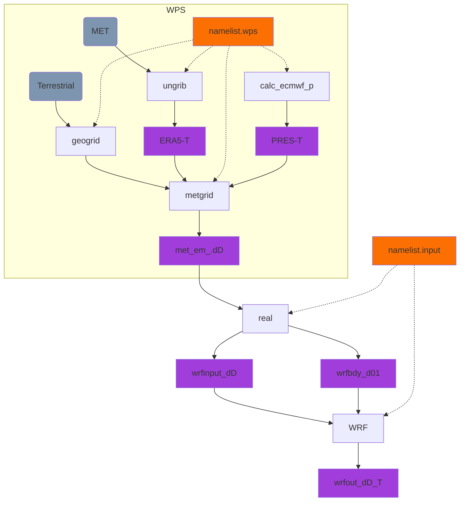

# WRF-Volcano tutorial 

This page is written by Alex Poulidis (Bremen University) and Sébastien Biass (Université de Genève) and is designed to provide a hands-on approach to running WRF for applications in volcanology. Feel free to use any of the material for research or education purposes, but we would be grateful if you could contribute back with any new material.

## Getting started

### Cluster documentation

- [Yggdrasil](https://doc.eresearch.unige.ch/hpc/start) (Université de Genève)

### WRF documentation

- 📖 [WRF user guide](https://www2.mmm.ucar.edu/wrf/users/docs/user_guide_v4/v4.4/contents.html)

### Download ERA5 data 

- Using MARS (&rarr; UNIGE users)

- ERA5 data should be placed in `/srv/beegfs/scratch/shares/wrf_volcano/MET/ERA5/case_name`

## Setup a run 

1. On the cluster Copy/clone script from `/srv/beegfs/scratch/shares/wrf_volcano/`.
2. Run `./setup_wrf.sh case_name`, where `case_name` is your project/case name. This will:

    1. Create a folder named `WRF_projects/case_name/` both on `HOME` and on `scratch`. 
    2. The folder on the `HOME` partition contains the config files (i.e., `namelist.*`) and are backed up.
    3. The folder on the `scratch` partition contains the `WPS/` and `WRF/` folders, which will store most of the data.

### Overview of the WRF workflow

The process of running WRF consists of two steps:

1. Pre-processing using the WRF Preprocessing System (`WPS`):
   
   > WPS is a set of three programs whose collective role is to prepare input for real-data simulations

2. Running `WRF`.

!!! info "Variables"
    In the above flowchart and in the description below:

    - `T` represents **time** is a string of format `yyyy-mm-dd_hh`
    - `D` represents a **domain** numbered as *1* &rarr; *n*, where *1* is the outermost domain and *n* is the number of domains

### Setup WPS 

📖 [WPS user guide](https://www2.mmm.ucar.edu/wrf/users/docs/user_guide_v4/v4.4/users_guide_chap3.html)

1. `cd case_name/WPS` 
2. Edit the `namelist.wps` configuration file for **WPS**
3. `module load GCC/10.3.0 OpenMPI/4.1.1 WPS`
4. `srun geogrid.exe`

    > Define the simulation domains, and to interpolate various terrestrial data sets to the model grids.
    > &rarr; Outputs one NetCDF file per domain

5. `srun ungrib.exe`

    > Creates intermediary files (e.g., translate data from ERA, GFS or any other met model)
    >
    > &rarr; Creates one `ERA5-T` file per time step

6. `srun calc_ecmwf_p.exe` 
    
    > Calculates pressure levels for specifically for ERA5
    >
    > &rarr; Creates one `PRES-T` file per time step

    !!! info ERA5
        Not all reanalysis datasets have all the variables required for `WRF` and this step is specific to ERA5.

7. `srun metgrid.exe`
    
    > Interpolates the intermediate-format meteorological data that onto the simulation domains defined by `geogrid`
    > 
    > &rarr; Creates one `met_em_.dD...` file per domain per time step

8. Ouptut from `metgrid` is in `WPS/output/`

!!! info "Using run_wps.sh"

    All steps can be automatised by running `sbatch run_wps.sh`

### Case setup / WRF 

📖 [User guide](https://www2.mmm.ucar.edu/wrf/users/docs/user_guide_v4/v4.4/users_guide_chap5.html#realcase)

1. `cd ../WRF`
2. Edit the `namelist.input` configuration file

3. `srun real.exe`: Reads the `met_em...` files and creates input and boundary files, 
    - input files being the atmospheric state at $t=0$ &rarr; `wrfinput_dD`
    - boundary files are tendencies (±fluxes) at the border to represent future states &rarr; `wrfbdy_d01` &rarr; only outer domain

    !!! info
        - at $t=0$, everything is based on input data 
        - at $t>0$, input data only affect boundaries

4. Job submission `sbatch wrf`
    - Ouptut in `case_name/WRF/output`

!!! info "Using run_wrf.sh"

    All steps can be automatised by running `sbatch run_wrf.sh`. Adapt the number of required CPU using `ntasks` and `-n` as needed.

    ❗Too many processors can prevent the run to complete.
