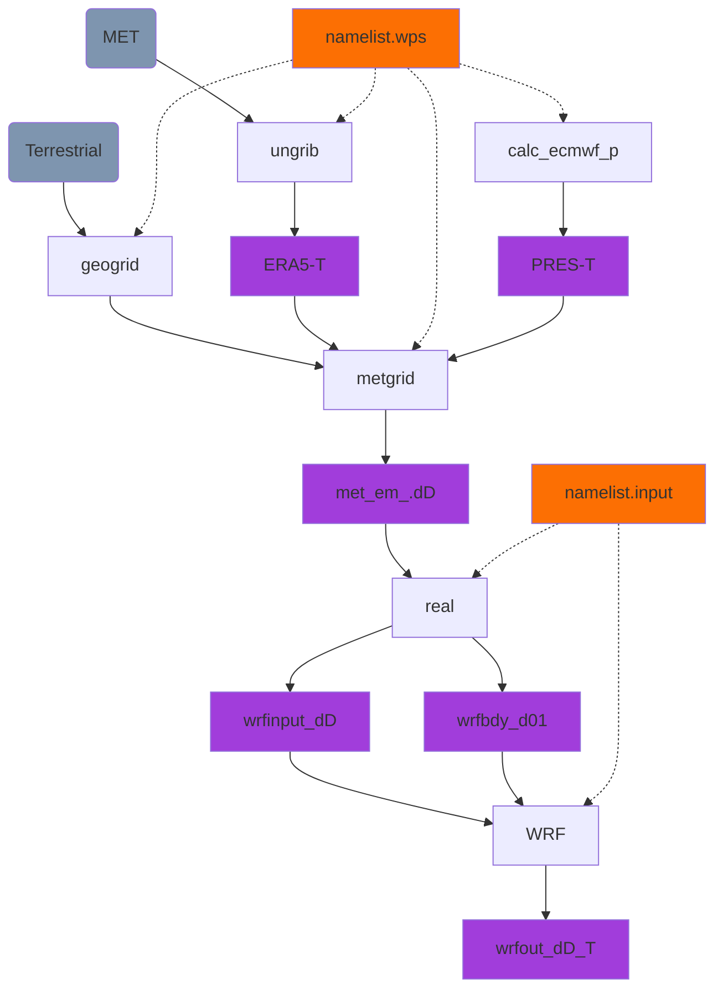

# WRF-Volcano tutorial 

This page is written by Alex Poulidis (Bremen University) and Sébastien Biass (Université de Genève) and is designed to provide a hands-on approach to running WRF for applications in volcanology. Feel free to use any of the material for research or education purposes, but we would be grateful if you could contribute back with any new material.

## Getting started

### Cluster documentation

- [Yggdrasil](https://doc.eresearch.unige.ch/hpc/start) (Université de Genève)

### Download ERA5 data 

- Using MARS (&rarr; UNIGE users)

### Setup a run 

1. On the cluster, create a `WRF/` folder somewhere on the `scratch` partition
2. Copy/clone script from `/srv/beegfs/scratch/shares/wrf_volcano/`
3. Run `./setup_wrf.sh case_name`, where `case_name` is your project/case name

This step creates a `case_name/` directory populated with `WPS/` and `WRF/` folders.

### Overview of the WRF workflow

!!! info "Variables"
    In the above flowchart and in the description below:

    - `T` represents **time** is a string of format `yyyy-mm-dd_hh`
    - `D` represents a **domain** numbered as *1* &rarr; *n*, where *1* is the outermost domain and *n* is the number of domains

### Setup WPS 

1. `cd case_name/WPS` 
2. Modify `namelist.wps` &rarr; configuration file for **WPS**
3. `module load GCC/10.3.0 OpenMPI/4.1.1 WPS`
4. `srun geogrid.exe`

    > &rarr; Interpolates terrestrial data to domain
    > 
    > &rarr; Outputs one ncfile per domain

5. `srun ungrib.exe`

    > &rarr; prepares a dictionary and creates intermediary files that WPS  can read (e.g., translate data from ERA, GFS or any other met model)
    >
    > Creates `ERA5-T` &rarr; one file per time step

6. `srun calc_ecmwf_p.exe` 
    
    > &rarr; calculates pressure levels for ERA5
    >
    > Creates `PRES-T` &rarr; one file per time step

7. `srun metgrid.exe`
    
    > &rarr; creates input files for `WRF real.exe` 
    > 
    > Creates `met_em_.dD...` &rarr; one file per domain per time step

8. Ouptut from `metgrid` is in `WPS/output/`

### Case setup / WRF 

1. `cd ../WRF`
2. Input config file: `namelist.input` 

3. `srun real.exe`: Reads the `met_em...` files and creates input and boundary files, 
    - input files being the atmospheric state at $t=0$ &rarr; `wrfinput_dD`
    - boundary files are tendencies (±fluxes) at the border to represent future states &rarr; `wrfbdy_d01` &rarr; only outer domain

    !!! info
        - at $t=0$, everything is based on input data 
        - at $t>0$, input data only affect boundaries

4. Job submission `sbatch wrf`
    - Ouptut in `case_name/WRF/output`

    !!! hint "How to check the status of a run?"

        - `tail rsl.error.0000` &rarr; check computation time for each time step and estimate the remaining time 
        - Check files with `ncview` &rarr; check vertical velocity
        - Bad runs:
            1. Crashed, still running but outputting only Nan
            2. Checkerboard pattern following grid points 
            3. Large values (±60 ms-1)
    
